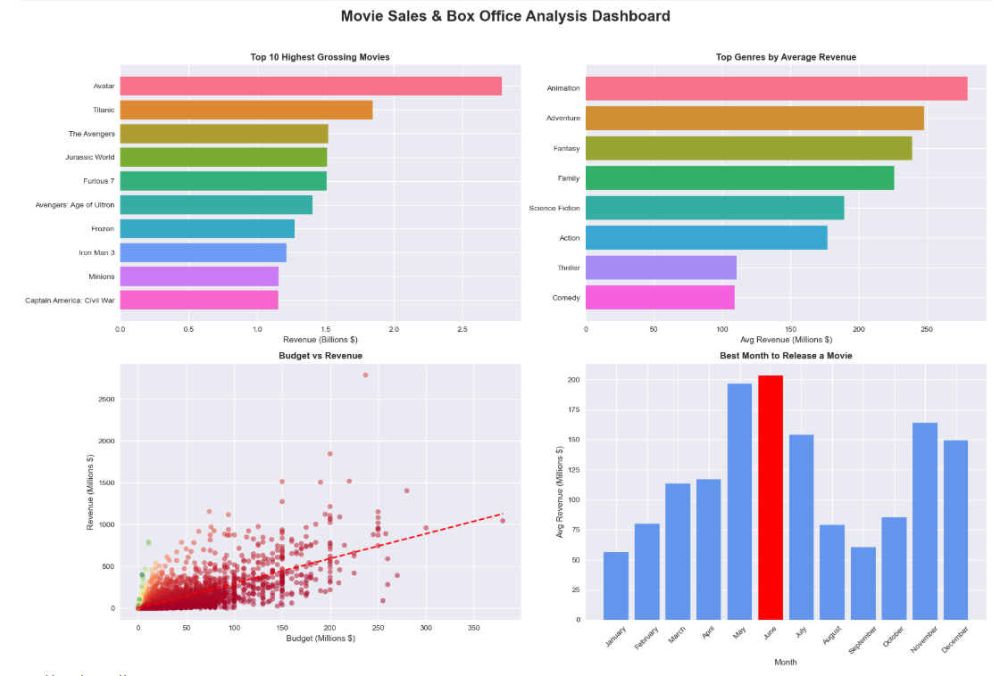

# 🎬 Movie Sales & Box Office Analysis

## Overview
Analysis of 3,200+ movies using Python to uncover 
box office trends, genre performance, and revenue patterns.

## Key Findings
- 🏆 Highest Grossing Movie: Avatar
- 🎭 Most Profitable Genre: Animation
- 📅 Best Release Month: June
- 💰 Average ROI: 321.4%
- 💵 Average Budget: $41M → Average Revenue: $121.6M

## Visualizations

## Tools Used
Python · Pandas · Matplotlib · Seaborn · NumPy · Jupyter Notebook

## Dataset
TMDB 5000 Movies Dataset — Kaggle

## Author
Mehak Parekh |
